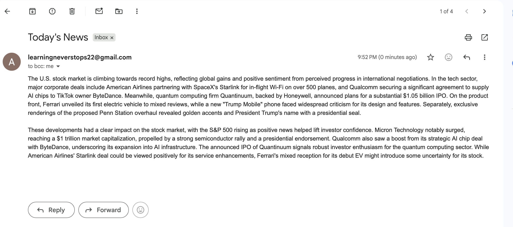

# AI News Summarizer
An AI-powered Python project that fetches the latest business news, summarizes it using Google's Gemini AI model, and sends the summary directly through email.

---

## Features

- Fetches latest business news using NewsAPI
- Uses Gemini AI via LangChain for summarization
- Generates stock-market impact analysis
- Sends summarized news via Gmail SMTP
- Uses environment variables for security

---

### Email Output Preview

## Technologies Used

- Python
- LangChain
- Gemini API
- NewsAPI
- SMTP
- dotenv

---

## Project Structure

bash project4/ │ ├── main.py ├── send_email.py ├── simple_ai.py ├── requirements.txt ├── .gitignore └── .env 

---

## Installation

### 1. Clone the repository

bash git clone YOUR_REPOSITORY_LINK cd project4 

---

### 2. Create virtual environment

bash python -m venv .venv 

Activate it:

#### Mac/Linux

bash source .venv/bin/activate 

#### Windows

bash .venv\Scripts\activate 

---

### 3. Install dependencies

bash pip install -r requirements.txt 

---

## Environment Variables

Create a .env file in the project root:

env GOOGLE_API_KEY=your_google_api_key NEWS_API_KEY=your_newsapi_key GMAIL_PASSWORD=your_gmail_app_password 

---

## Running the Project

Run:

bash python main.py 

The application will:
1. Fetch latest business headlines
2. Generate AI summary
3. Analyze stock market impact
4. Send the report via email

---

## Example Workflow

- NewsAPI fetches business articles
- Gemini AI summarizes them
- Gmail SMTP sends the email automatically

---

## Security Notes

- Never upload .env file to GitHub
- Use Gmail App Password instead of your real password

---

## Future Improvements

- Add HTML email formatting
- Create web interface using Flask
- Add category selection
- Schedule daily automatic emails
- Store news history in database

---

## Author

Anjali Chauhan

Second-year BTech CSE (AI/ML)